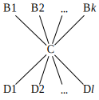
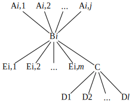

# OWL Close World

[  ](https://bintray.com/opencaesar/owl-tools/owl-close-world/_latestVersion)

A library of different algorithms to close the world on OWL ontologies

## Vocabulary Bundle Closure

### Introduction

One of the key features of the Semantic Web (and its formal foundations in Description Logic) is the so-called open-world semantics, which means simply that any unasserted claim may be true or false. The world of ordinary human interaction is open in just this way; if neither author of this paper is known to be a graduate of UCLA, then either might be. And in fact, one is and one is not.

Open-world semantics typically do not apply in traditional database applications. If my name does not appear in the table of customers, then an application is justified in concluding I am not (yet) a customer.

Neither open- nor closed-world semantics are “correct”, per se. Each has its appropriate uses, and it is important to be aware of the semantics in effect and draw proper conclusions.

One aspect of open-world semantics that is sometimes surprising to people familiar with object-oriented software development has to do with implicit disjointness. Suppose, for example, in Java, we declare classes as follows:
```
public class Vehicle {}
public class Person {}
```
We naturally expect that an object may be a `Vehicle` or it may be a `Person`, but it cannot be both. That is, the sets of objects of type `Vehicle` and `Person` are _disjoint_. Formally, two sets are disjoint if their intersection is empty.

If instead, however, we want to declare classes that are not disjoint because one is a subclass of the other, Java requires us to declare the relation explicitly:
```
public class Vehicle {}
```
The situation with OWL and the Semantic Web is somewhat different. Suppose we declare OWL classes as follows:
```
Declaration(Class(Vehicle))
```
If we assert nothing further, then any pair of classes may have a nonempty intersection. To assert the the situation from the Java example, we must add two axioms:
```
DisjointClasses(Vehicle Person)
SubClassOf(Car Vehicle)
```
Note that we do not need to assert
```
DisjointClasses(Car Person)
```
That fact follows from the definition of disjointness--a DL reasoner will infer it. Note also that, while it is probably not what we mean, it would not be logically inconsistent to assert
```
DisjointClasses(Car Vehicle)
```
A reasoner will include that the set of cars is empty, but the empty set is a valid set. A class that can have no members is said to be _unsatisfiable_.

### Disjointness Maintenance

The general problem of disjointness maintenance is the augmentation of a taxonomy with disjointness axioms that encode a specific policy for vocabulary closure. It is of utmost importance to note that these disjointness axioms are in no sense implied by the taxonomy itself; indeed, the open world interpretation is that two classes are not considered to be disjoint unless explicitly declared to be so or if their disjointness is implied by mutually exclusive constraints such as property range or cardinality restrictions.

The policy to be implemented here is simple: any two classes that have no common subclass are considered to be disjoint. A simple corollary is that, if _B_ is a subclass of _A_, then _A_ and _B_ are not disjoint because _A_ and _B_ have a common subclass, namely _B_. Also note that disjointness is inherited: if _A_ and _B_ are disjoint, then every subclass of _A_ is disjoint with every subclass of _B_. We can use this fact to make our generated disjointness axioms concise.

This policy is inappropriate for, say, biological taxonomies in which we seel to classify objects as they exist in the real world, without teleological context. In that case, disjointness is a feature to be discovered (or not). Developing a vocabulary for engineering, in contrast, involves identifying important concepts and noting that, in many cases, these concepts are disjoint. By definition, an engineering requirement, the system component bound by that requirement, and the supplier of that component cannot be the same thing; they belong to disjoint categories. It is appropriate in this cases to declare our intent that the ontological classes `Requirement`, `Component`, and `Supplier` are disjoint.

The implemented policy simply makes disjointness the default. Exceptions must be stated explicitly.

The objectives of a disjointness maintenance algorithm are threefold:

1. to implement the disjointness policy,
2. to minimize the number of disjointness axioms generated, and
3. to generate disjointness axioms of tractable computational complexity for a reasoner.

The final item is beyond the expertise of the authors. We focus on the first two and hope for the best with the third.

### The Simplest Case
Consider the case of a taxonomy that is a _directed rooted tree_ in the graph-theoretic sense. A _tree_ is an undirected graph that is connected and acyclic. (An equivalent condition is that there is exactly one path between any two vertices.) A _directed tree_ is a tree in which the edges are directed, and a _rooted tree_ is a directed tree in which a single vertex is designated the _root_. For this discussion we will take edge direction to be from subclass to superclass; the parents of a vertex correspond to its superclasses and its children correspond to its subclasses. The root vertex is the universal set _U_.

#### Theorem 1
_Declaring all sibling subclasses of every class disjoint satisfies the disjointness policy._
##### Proof: Necessity
Any two sibling subclasses _A_ and _B_ of a common superclass cannot share a common subclass. If a common subclass existed, there would be two paths to the root from it: one through _A_ and one through _B_. Every tree contains exactly one path between any pair of vertices, so a common subclass cannot exist.
##### Proof: Sufficiency
Proof. Any two sibling subclasses _A_ and _B_ of a common superclass cannot share a common subclass. If a common subclass existed, there would be two paths to the root from it: one through _A_ and one through _B_. Every tree contains exactly one path between any pair of vertices, so a common subclass cannot exist.
### The General Case
In the general case, we cannot assume the taxonomy is a tree. There may be explicitly-asserted common subclasses, and these invalidate the assumptions that led to the simple algorithm in the simple case.

One possible strategy for dealing with the general case is to apply a set of transformations to an arbitrary taxonomy that result in a tree and then apply the simple algorithm to the tree. These transformations should be chosen in such a way that the disjointness policy is still satisfied: that every pair of classes without an explicit common subclass is disjoint. In the event we cannot find a transformation that preserves the policy, it is important to ensure that the transformed taxonomy does not result in spurious unsatisfiability. That is, the transformed (relaxed) taxonomy may generate weaker disjointness constraints than the original, but must not generate stronger constraints than implied by the original.

The subclass relation is transitive, that is, if _A_ is a subclass of _B_ and _B_ is a subclass of _C_, then _A_ is a subclass of _C_. It is true in this case that _A_ is a common subclass of _B_ and _C_, but so is _B_. The fact that _A_ is a subclass of _C_ does not rule out any disjointness not already ruled out. In the following discussions of algorithms, we will assume that the input has undergone transitive reduction and is maintained in reduced state.

### Bypass-Reduce-Isolate Algorithm

#### Theory
Let _T_ be a rooted taxonomy and let _G_ be the transitive reduction of a graph whose edges represent the is-subclass-of relation. Further suppose that _G_ is a directed acyclic graph. Then the ancestors of a class _A_ in _G_ correspond to the superclasses of _A_ (omitting _A_) in _T_ and the descendants of _A_ in _G_ correspond to the subclasses of _A_ (omitting _A_) in _T_.

Suppose there exists a class _C_ such that _C_ ⊆ _B_<sub>1</sub>, _C_ ⊆ _B_<sub>2</sub>, …, _C_ ⊆ _B_<sub>_k_</sub> (where _k_ > 1), _D_<sub>1</sub> ⊆ _C_, _D_<sub>2</sub> ⊆ _C_, …, _D_<sub>_l_</sub> ⊆  _C_ (where _l_ ≥ 0), and the sub-taxonomy rooted at _C_ is a tree.



Note that there may be other ancestors of _B_<sub>_i_</sub> and descendants of _D_<sub>_i_</sub> not shown, but there are no edges from any ancestor of _C_ to any descendant of _C_.)

Consider a particular parent of _C_, _B_<sub>_i_</sub>, and its parents _A_<sub>1</sub>, _A_<sub>1</sub>, …, _A_<sub>_j</sub>. Because _T_ is rooted, _j_ > 0.



Note that the fact that _T_ is in reduced form implies that no _B_<sub>_n_</sub> is a sub- or superclass of _B_<sub>_i_</sub> for _n_ ≠ _i_.

The first step of the procedure makes use of the identity _B_<sub>_i_</sub> ≡ (_B_<sub>_i_</sub> \ _C_) ⋃ (_B_<sub>_i_</sub> ∩ _C_). Because there are no edges from _C_ or any of its descendants to any _E_<sub>_j*_</sub>, we can use the disjointness policy to rewrite the graph as shown below:


## Description Bundle Closure
